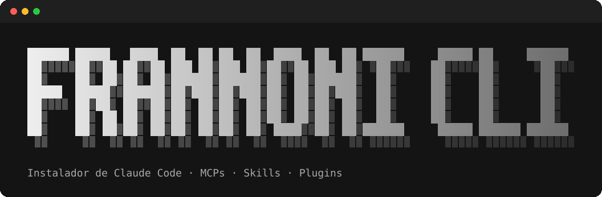

<p align="center">
  
</p>

<p align="center">
  <b>Dejá Claude Code listo para usar en un solo comando.</b><br>
  MCPs, skills, plugins y GSD · macOS, Windows y Linux · gratis
</p>

<p align="center">
  <a href="https://www.youtube.com/@frannoni?sub_confirmation=1"></a>
</p>

## Instalación

**macOS / Linux** (Terminal o Warp):

```bash
curl -fsSL https://raw.githubusercontent.com/FranciscoAnnoni/frannoni-cli/main/install.sh | bash
```

**Windows** (PowerShell o Warp):

```powershell
irm https://raw.githubusercontent.com/FranciscoAnnoni/frannoni-cli/main/install.ps1 | iex
```

El comando instala lo que falte (Node 18+, Git y Claude Code), pregunta si querés instalar la terminal [Warp](https://www.warp.dev) (la recomendada) y abre el menú:

1) Todo · 2) MCPs base · 3) MCPs opcionales · 4) Skills · 5) Plugins · 6) GSD · 7) Ver config actual

**Todo** instala MCPs base, skills y plugins sin preguntar. Lo único que pregunta es si querés configurar MCPs con token y, en ese caso, cuáles. Al terminar abre el canal de YouTube [@frannoni](https://www.youtube.com/@frannoni).

Desde el repo clonado también se puede correr con `./install.sh` (Mac/Linux) o `powershell -ExecutionPolicy Bypass -File install.ps1` (Windows).

## Archivos

| Archivo | Qué es |
|---|---|
| `install.sh` | Arranque para macOS/Linux: instala dependencias y corre el instalador. |
| `install.ps1` | Arranque para Windows: ídem, con `winget`. |
| `installer.mjs` | El instalador (menú, MCPs, skills, plugins, GSD). Node puro, igual en los tres sistemas. |
| `mcps.json` | MCPs: `base` (sin token) y `optional` (con token o cuenta). |
| `skills.txt` | Repos de skills y cuáles instalar de cada uno. |
| `plugins.txt` | Plugins de Claude Code y su marketplace. |

Para agregar o sacar algo, se edita el archivo correspondiente; el script no tiene nada hardcodeado.

## MCPs base (sin token)

Se agregan uno por uno con `claude mcp add-json <nombre> <json> -s user` (quedan en `~/.claude.json`, disponibles en todos los proyectos). Si uno ya existe, se mantiene.

| MCP | Para qué |
|---|---|
| `sequential-thinking` | Razonamiento paso a paso |
| `context7` | Docs actualizadas y por versión de librerías (sin key usa el límite gratis) |
| `deepwiki` | Preguntas y docs sobre cualquier repo público de GitHub |
| `chrome-devtools` | Controlar y depurar Chrome |
| `excalidraw` | Diagramas |

## MCPs opcionales (con token / cuenta)

El instalador pregunta uno por uno cuáles querés y pide el token de cada uno (el input no se muestra). Si ya existe, pregunta si reconfigurarlo, así que nunca pisa una key sin avisar.

| MCP | Auth | Dónde sacar el token |
|---|---|---|
| `github` | Token (PAT fine-grained, solo con los repos y permisos que necesites). | https://github.com/settings/personal-access-tokens/new |
| `firecrawl` | Token opcional. Sin key: scrape/search con límite. | https://www.firecrawl.dev/app/api-keys |
| `context7` | Token. Reemplaza al base con uno con más límite. | https://context7.com/dashboard |
| `obsidian` | Token. Necesita el plugin **Local REST API** con *Enable HTTP server* activado. | Obsidian → Settings → Local REST API |
| `alphavantage` | Token opcional. Sin key: login OAuth. | https://www.alphavantage.co/support/#api-key |
| `21st` | Token. Busca componentes de UI gratis; generar y bajar código consume créditos. | https://21st.dev/mcp |
| `notion` | OAuth (sin token). | — |

Los que usan OAuth se autentican la primera vez desde Claude Code con `/mcp`.

## Skills

Se instalan con [`npx skills add`](https://skills.sh) en `~/.claude/skills/` (global, solo para Claude Code).

| Repo | Skills | Para qué |
|---|---|---|
| [emilkowalski/skills](https://github.com/emilkowalski/skills) | todas | Diseño y animación de UI. Incluye **`/prototype`**: arma varias versiones distintas de una pieza de UI con un selector para compararlas. Solo corre si la invocás. |
| [anthropics/skills](https://github.com/anthropics/skills) | `frontend-design`, `webapp-testing` | Frontend con buen diseño y testeo de apps web. |

Actualizar después: `npx skills update -g`.

## Plugins

| Plugin | Para qué |
|---|---|
| [superpowers](https://github.com/obra/superpowers) | Método de trabajo: brainstorming → plan → TDD → debugging → code review. |

Si el marketplace no está agregado, el instalador lo agrega antes.

## Seguridad

- **Leé el script antes de correrlo.** `curl | bash` e `irm | iex` ejecutan lo que esté en `main` en ese momento. Todo el código está en este repo: `install.sh`, `install.ps1` e `installer.mjs`.
- **Instala cosas de terceros, en su última versión** (`@latest`): los MCPs de npm, las skills de [emilkowalski/skills](https://github.com/emilkowalski/skills) y [anthropics/skills](https://github.com/anthropics/skills), el plugin Superpowers y GSD. No están fijados a una versión, así que confiás también en esos autores.
- **Los tokens quedan en texto plano en `~/.claude.json`**: así guarda Claude Code los MCPs. El instalador no los manda a ningún lado. Usá tokens con el mínimo permiso y revocalos si dejás de usarlos.
- **Lo único que se instala sin preguntar es lo imprescindible**: Node, Git, Claude Code y, en Mac, Homebrew. Warp y los MCPs con token se preguntan antes.

## GSD (opcional)

[Get Shit Done](https://github.com/gsd-build/get-shit-done): método por fases (spec → plan → ejecución → verificación). No entra en **Todo** porque se pisa con Superpowers y es pesado: la versión completa ocupa ~12k tokens de contexto en cada sesión. La opción 6 instala la mínima (`--minimal`, 7 skills, ~700 tokens). Para la completa: `npx get-shit-done-cc@latest --claude --global`.

---

<p align="center">
  <b>¿Te sirvió? Suscribite para más contenido 👇</b><br><br>
  <a href="https://www.youtube.com/@frannoni?sub_confirmation=1"></a>
</p>
